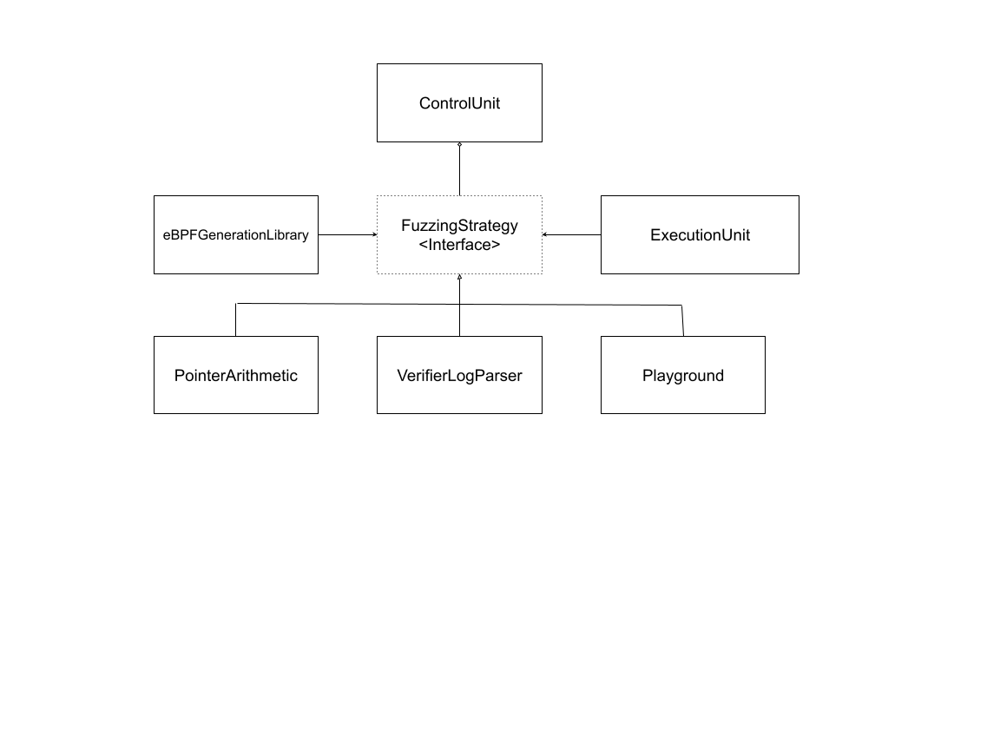
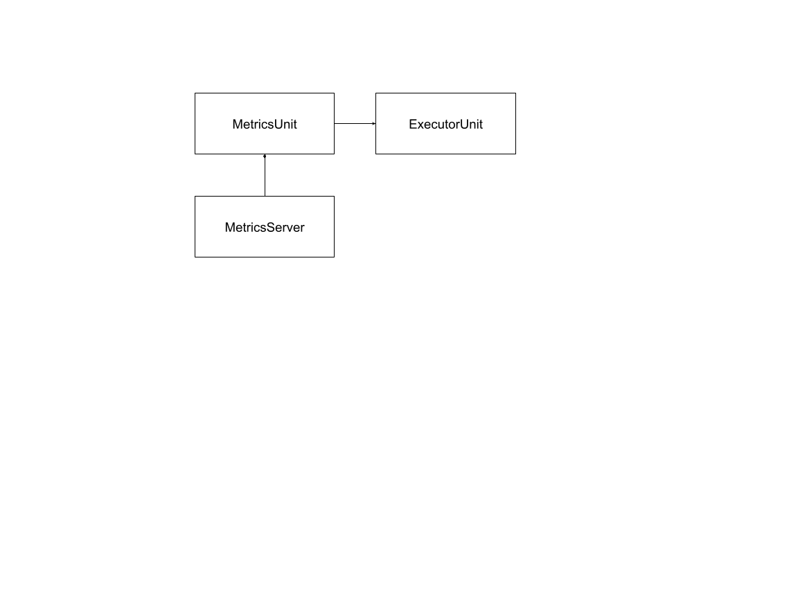

# Buzzer Architecture

The overall architecture of buzzer is the following:

Elements:
  * ControlUnit: Kicks off the FuzzingStrategy specified via the 
    `--fuzzing_strategy` command line flag.
  * eBPFGenerationLibrary: Contains the logic to generate eBPF Programs
  * ExecutionUnit: FFI layer to interact with the eBPF Syscall and load/execute
    eBPF programs.
  * FuzzingStrategy: Interface that all strategies must implement.

A **Fuzzing Strategy** is the combination of how eBPF Programs are generated
and how bugs are detected.

Currently, Buzzer has three possible strategies:
  1. PointerArithmetic: Generates random ALU and JMP operations, then attempts
     to do pointer arithmetic over a map pointer, and write to it. If the value
     written is not visible from user land then assume we wrote OOB.
  1. VerifierLogParser: Generates random ALU operations and parses the output
     of the eBPF Verifier log. At run time of the program, the values of the
     registers are stored and then compared with the assumptions that the
     verifier exposed through the log.
  1. Playground: No real fuzzing is done here, this strategy is here just to
     help experiment with eBPF.

## Other Features

Buzzer also has an integrated metrics server capable of rendering coverage
information, the architecture of this component looks like this:

Every time the `ExecutorUnit` verifies a program it passes the information to the
`MetricsUnit` the following information:

  * If the program passed validation or not
  * Any coverage information collected by kcov (if it is enabled)

The metrics unit then processes this information, resolving kcov addresses to
code locations and presents this information in a web interface.

For information on how to enable metrics collection see the
[running buzzer with coverage](../guides/running_with_coverage.md) guide.
