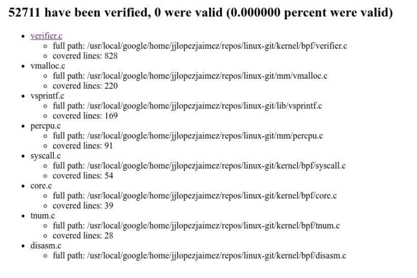
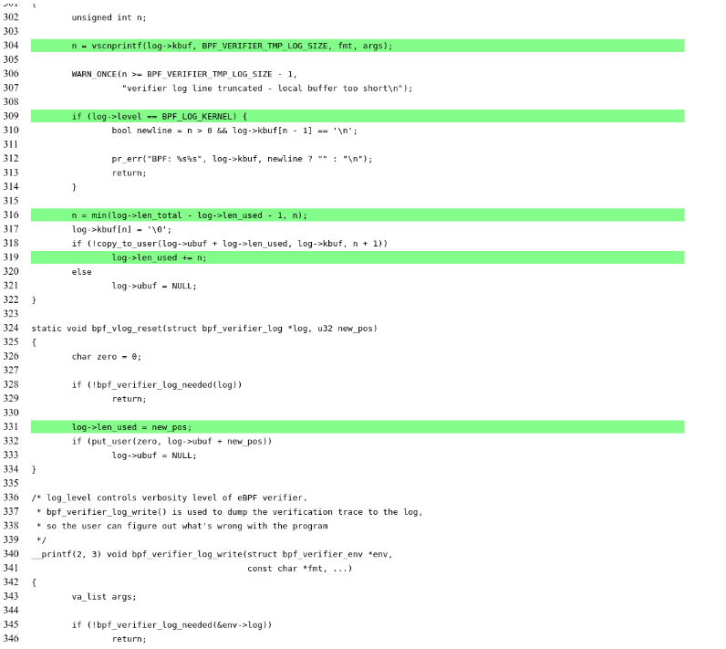

# How to run Buzzer with coverage

## Pre-work

Follow the [syzkaller instructions](https://github.com/google/syzkaller/blob/master/docs/linux/setup_ubuntu-host_qemu-vm_x86-64-kernel.md) on how to setup a vm running a Debian Image.

**Note 1:** Make sure to enable BPF when compiling your linux kernel
(`CONFIG_BPF=y` and `CONFIG_BPF_SYSCALL=y`).

**Note 2:** The syzkaller instructions guide you to create a `Debian Stretch`
image, however `CAP_BPF` is not supported by that version. While you can still
run Buzzer as root in Debian Stretch, if you want to use `CAP_BPF` consider
generating a `bullseye` image: 

```
./create-image.sh -d bullseye
```

## Run the vm

You can use the following command to run the vm generated by syzkaller

```bash
qemu-system-x86_64 \
        -m 20G \
        -smp 2 \
        -cpu host \
        -kernel PATH_TO_KERNEL_REPO/arch/x86/boot/bzImage \
        -append "console=ttyS0 root=/dev/sda nokaslr earlyprintk=serial net.ifnames=0" \
        -drive file=PATH_TO_DEBIAN_IMAGE/bullseye.img,format=raw \
        -net user,host=10.0.2.10,hostfwd=tcp:127.0.0.1:10022-:22,hostfwd=tcp:0.0.0.0:8080-:8080 \
        -net nic,model=e1000 \
        -enable-kvm \
        -nographic \
        -pidfile vm.pid \
        2>&1 | tee vm.log

```

Make sure to replace `PATH_TO_KERNEL_REPO` and `PATH_TO_DEBIAN_IMAGE` with the
right values.

Also notice that there is a portforwarding of port 8080, this is the default
port of the metrics server and can be changed with the Buzzer flag
`metrics_server_port`.

## Running buzzer with coverage enabled.

### Transferring vmlinux into the VM

Once the vm is running, transfer your vmlinux image to your /root directory.

In future releases this step might become obsolete but for now this is how
buzzer looks for coverage information, in your **host** computer run:

```bash
scp -i PATH_TO_DEBIAN_IMAGE/bullseye.id_rsa -P 10022 PATH_TO_KERNEL_REPO/vmlinux root@localhost:~/
```

### Transferring the source files you want coverage on.

First, create a directory named `sourceFiles` under your vm /root directory,
in your **vm** run:

```bash
mkdir /root/sourceFiles
```

Then transfer into that directory any source files you want fuzzer to visualize
coverage information, for example the verifier source code, in your **host**
computer run:

```bash
scp -i PATH_TO_DEBIAN_IMAGE/bullseye.id_rsa -P 10022 PATH_TO_KERNEL_REPO/kernel/bpf/verifier.c  root@localhost:~/sourceFiles
```

### Run Buzzer and access the metrics server

Transfer buzzer into your vm by running the following command in your host machine

```bash
scp -i PATH_TO_DEBIAN_IMAGE/bullseye.id_rsa -P 10022 PATH_TO_BUZZER  root@localhost:~/
```

And then in your vm simply run buzzer:

```bash
./buzzer
```

Then if you go to localhost:8080 in your host machine you should be able to
see the metrics server



